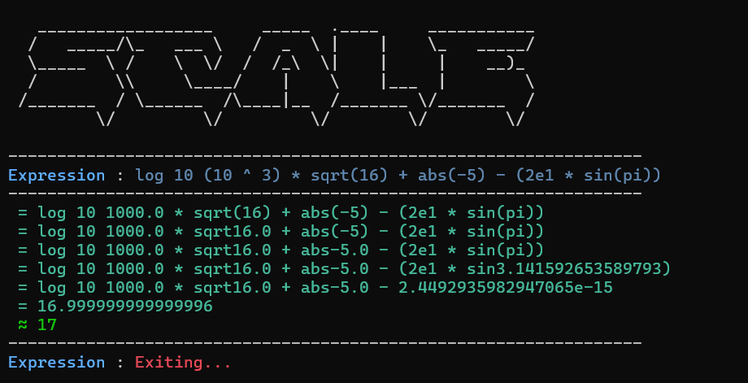
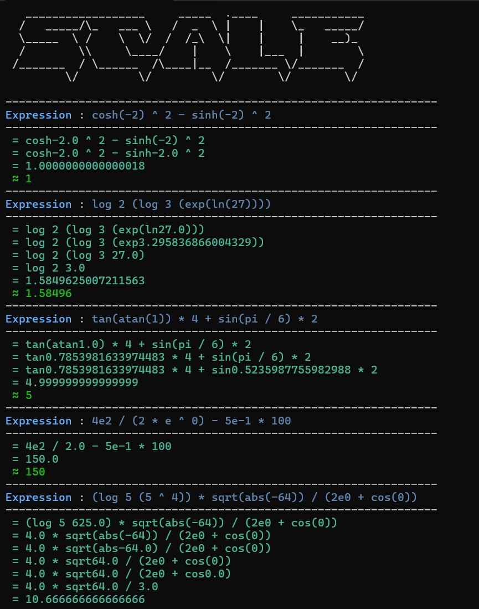

# 🧮 SCALE Command-Line Calculator




Welcome to **SCALE**, a powerful and interactive command-line calculator written in Python! This program uses the Shunting-yard algorithm and Reverse Polish Notation (RPN) to parse and evaluate complex mathematical expressions safely and accurately.

It also features a step-by-step "peeler" that visually breaks down expressions by evaluating parentheses from the inside out, and it cleans up floating-point artifacts for a polished result! 🚀

## 🚀 Getting Started

### Prerequisites

* Python 3.x installed on your system.
* The `main.py` file downloaded and ready in your working directory.

### How to Run

Simply open your terminal or command prompt and run the following command:

```bash
python main.py
```

To exit the calculator, type `quit`, `exit`, `q`, or use `Ctrl+C`.

---

## ⚙️ How the Code Works

Under the hood, SCALE processes your math problems using a combination of clever parsing and classic computer science algorithms:

1. **Tokenizer (Regex):** When you type an expression, the program uses Regular Expressions (`re.findall`) to chop your string into recognizable "tokens" (numbers, math operations, and constants).

2. **The "Peeler" (`peeler` function):** If your equation has parentheses `()`, SCALE finds the innermost set of parentheses, isolates the expression inside, and sends it to the evaluation engine. It then replaces the parentheses with the evaluated answer and repeats the process, printing each step to the console.

3. **Shunting-Yard Algorithm (`rpn_creator`):** To evaluate a peeled mathematical string, SCALE converts standard math notation (Infix) into **Reverse Polish Notation (RPN)**. This sorts the operators and numbers by mathematical precedence (e.g., ensuring multiplication happens before addition).

4. **RPN Evaluator (`evaluate_rpn`):** Finally, a stack-based evaluator runs through the RPN list, applying the correct Python `math` or `operator` functions to calculate the precise numerical result.

---

## ⚠️ Important Syntax Rules

To ensure the calculator parses your expressions correctly, please follow these core syntax rules:

### 1. Mandatory Parentheses for Expressions in Functions
If you are passing an **expression** (a calculation) into a function like `sin`, `cos`, or a `log` base/value, **you MUST wrap the expression in parentheses.** Otherwise, the program will calculate the function on the first number only, and *then* apply the rest of the equation.

* ❌ **Incorrect:** `sin 2 + 3` (Evaluates as: the sine of 2, plus 3)
* ✅ **Correct:** `sin(2 + 3)` (Evaluates as: the sine of 5)

### 2. Explicit Multiplication is Required
The calculator **does not support implicit multiplication**. You must explicitly use the `*` operator.

* ❌ **Incorrect:** `(894)(15)` or `5(2+3)`
* ✅ **Correct:** `(894)*(15)` or `5*(2+3)`

### 3. Logarithm Syntax
To use a logarithm with a custom base, the syntax strictly follows: `log<base> <value>`. Notice that there is **no space** between `log` and the base, but there **is a space** before the value. 

* **Custom Base (`log`):** To calculate $\log_6(23)$, type `log` immediately followed by the base (`6`), a space, and then the argument (`23`).
  * ✅ **Syntax:** `log6 23`
  * ✅ **Syntax with expressions:** `log6 (10 + 13)` or `log(2+4) (10+13)`

* **Base 10 (`lg`):** Works like a standard function.
  * ✅ **Syntax:** `lg(100)` or `lg100`

* **Natural Log (`ln`):** Works like a standard function.
  * ✅ **Syntax:** `ln(5)` or `ln5`

*(Note: you can add space after log or lg or ln like `log 6 23` or `lg 23` or `ln 23`)*

---

## 🔢 Supported Operations

Here are all the operations you can perform with SCALE:

### Basic Arithmetic

| Operator | Description | Example |
| :--- | :--- | :--- |
| `+` | Addition | `5 + 3` |
| `-` | Subtraction | `10 - 4` |
| `*` | Multiplication | `6 * 7` |
| `/` | Division | `20 / 4` |
| `%` | Modulo (Remainder) | `10 % 3` |
| `^` | Exponentiation (Power) | `2 ^ 3` |

### Unary & Math Functions

You can use these with or without parentheses for single numbers (e.g., `abs(-5)` or `abs -5`), but remember Rule #1 if evaluating expressions!

* **Absolute Value:** `abs`
* **Square Root:** `sqrt`
* **Unary Signs:** Built-in support for negative/positive signs (e.g., `-5 + 3`).

---

## 📐 Trigonometry: Radians vs. Degrees

Unlike a physical high school calculator, standard computer math libraries default to **Radians**. SCALE follows this standard, but includes built-in converters (`d` and `r`) to easily calculate in degrees.

### ⚠️ The Golden Rule of Angles
* **Inputs:** All standard trigonometric functions (`sin`, `cos`, `tan`) assume your input is in **radians**.
* **Outputs:** All inverse functions (`asin`, `acos`, `atan`) will return their results in **radians**.

### 🔄 Input Converter: Degrees to Radians (`d`)
The `d` operator is **for functions that normally take radians as input**. It converts your degree value into radians so the standard trig functions can compute them correctly.

You can use it as `d(val)` or `d val`.

* ❌ **Incorrect for 90 degrees:** `sin(90)` (Calculates the sine of 90 *radians*)
* ✅ **Correct for 90 degrees:** `sin(d(90))` or `sin(d 90)` (Converts 90 degrees to $\frac{\pi}{2}$ radians, returning `1.0`)
* ✅ **Using Math Inside:** `cos(d(30 * 2))` (Evaluates to `0.5`)

### 🔄 Output Converter: Radians to Degrees (`r`)
Because inverse functions output their answers in radians, you need a way to read that answer in degrees. The `r` operator is **for converting radian outputs back into degrees**.

You can use it as `r(val)` or `r val`.

* ❌ **Without `r`:** `asin(1)` (Returns `1.57079...` which is $\frac{\pi}{2}$ radians)
* ✅ **With `r`:** `r(asin(1))` or `r asin(1)` (Converts the radian answer back, returning `90.0` degrees)
* ✅ **Direct conversion:** `r(pi)` (Returns `180.0`)

### Supported Trig Functions
* **Standard:** `sin`, `cos`, `tan`
* **Inverse:** `asin`, `acos`, `atan`
* **Hyperbolic:** `sinh`, `cosh`, `tanh`, `asinh`, `acosh`, `atanh`

---

## 🧬 Understanding `e`, `exp`, and Scientific Notation

It's easy to get confused by the letter "e" in mathematics and computing. Here is exactly how SCALE interprets them:

### 1. The Constant `e` (Euler's Number)
When used by itself as a word, `e` represents Euler's number (approximately `2.71828...`).
* **Example:** `2 * e` will evaluate to `~5.436`

### 2. The Constant `pi` ($\pi$)
Similar to `e`, `pi` represents the mathematical constant Pi (approximately `3.14159...`).
* **Example:** `sin(pi / 2)` will evaluate to `1.0`

### 3. The Function `exp` (Exponential)
`exp` is a mathematical function that raises Euler's number `e` to the power of the number you provide ($e^x$).
* **Example:** `exp(2)` or `exp 2` is exactly the same as calculating `e ^ 2` but more accurate.

### 4. Scientific Notation (e.g., `1.5e3`)
When `e` or `E` is sandwiched tightly inside a number, it represents **Scientific Notation**, which means "times 10 to the power of". This is parsed as a *single number*, not an equation.
* **Example 1:** `1.5e3` means $1.5 \times 10^3$, which evaluates to `1500.0`.
* **Example 2:** `2E-4` means $2 \times 10^{-4}$, which evaluates to `0.0002`.

*(Note the difference: `2e3` is scientific notation for `2000`, whereas `2 * e ^ 3` is math using Euler's number!)*

---

## ✨ Step-by-Step Parentheses "Peeler"

One of the coolest features of SCALE is how it handles parentheses. If you input a nested expression like:
`((2 + 3) * (4 + 5))`

The program will visually "peel" and solve it step-by-step in the terminal:
1. ` = (5.0 * (4 + 5))`
2. ` = (5.0 * 9.0)`
3. ` = 45.0`

*(SCALE also includes a display formatter that cleans up tiny floating-point rounding errors, so answers like `16.999999999999996` print cleanly as `17.0`!)*

Enjoy calculating! 🎉